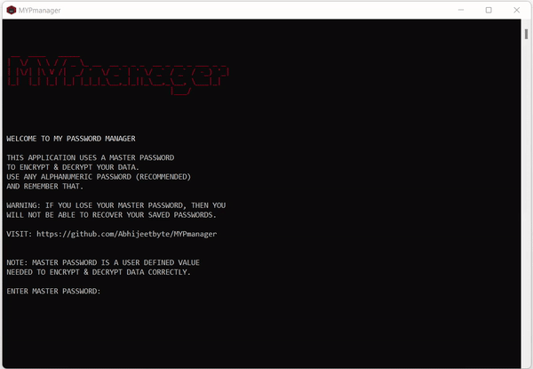
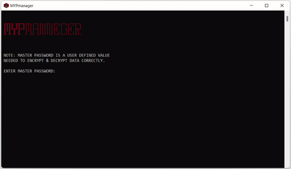

    
    <h1 align="center">MYPmanager</h1>
    <h4 align="center">
      A fast and dead-simple password/credential manager app
    </h4>
   

<!-- Badge section -->

 <!--added redme links, just to not go elseweher -->

My password manager (MYPmanager) is a Python-based tool/software, built to manage your passwords along with other credentials. 

 

## Features
* Standard Password manager offers basic operations like **Add**, **Search**, **Edit** and **Delete** etc.
* Only need to remember Master Password for all your saved credentials.
* Saves your passwords in encrypted form, **locally**
* Auto Backup as `.csv` file
* Available in both Portable (require no installation) and Installer 
 

## Getting started

<b>Prerequisites</b>:

* Your computer must be running Python3 or newer.
* The script requires [pandas](https://pandas.pydata.org/docs/index.html) and [tabulate](https://pypi.org/project/tabulate/) libraries installed.  
   - Open Terminal and run `pip install pandas` to install pandas library  
   - run `pip install tabulate` to install tabulate library 
  
* Get the source [code](https://github.com/Abhijeetbyte/MYPmanager/archive/refs/heads/main.zip)

* Extract the zip and open <b> main.py</b> in Python IDE to build and run the Password manager app. 

## Download

[Latest stable release.](https://github.com/abhijeetbyte/MYPmanager/releases/latest)

Releases and prereleases contain links to standalone packages
(and installers for full releases) for Windows
  
_Your computer must be running Windows 10 or newer._

* Install the latest version of the Application. [Download v1.5](https://github.com/Abhijeetbyte/MYPmanager/releases/download/v1.5/MYPmanager_setup.exe)
* Portable version [Download v1.5](https://github.com/Abhijeetbyte/MYPmanager/releases/download/v1.5/MYPmanager.exe)

 

## Intro

 

## Uses

 

## Reporting Issues & Contributions

Feel free to report <b>[issues](https://github.com/Abhijeetbyte/MYPmanager/issues/new)</b> and <b>contribute</b> to this repository

## License

Copyright © 2022 Abhijeet kumar. All rights reserved.

Licensed under the [CC0-1.0 License](LICENSE).
