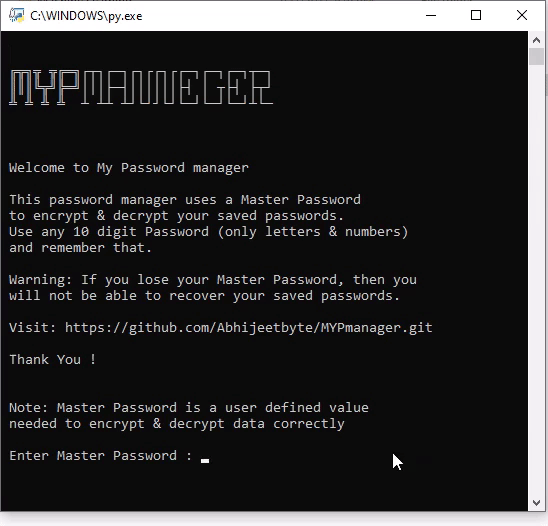
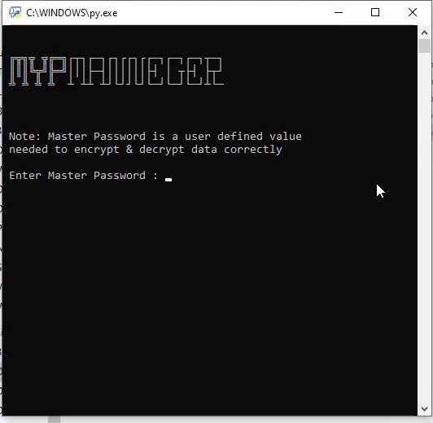

  

# MYPmanager

MYP manager is a Python-based tool/software, built to manage your passwords along with other credentials. 

# Features
* Standard Password manager offers basic operations like **Add**, **Search**, **Edit** and **Delete** etc.
* Only need to remember Master Password for all your saved credentials.
* Saves your passwords in encrypted form, locally

# Getting started

<!-- Badge section -->

 <!--added redme link, just to not go elseweher -->

<b>Prerequisites</b> :

* Your computer must be running Python3 or newer.
* The script requires [pandas](https://pandas.pydata.org/docs/index.html) library installed.  
   - open windows shell and run `pip install pandas` to install pandas library  
* Get the source [code](https://github.com/Abhijeetbyte/MYPmanager/archive/refs/heads/main.zip)

* Extract the zip and open <b> main.py</b> in Python IDE to build and run the Password manager app.

 **Windows users can download the binary release**
 
* Your computer must be running Windows 10 or newer.
* Install the latest version of the Application. [Download v1.0](https://github.com/Abhijeetbyte/MYPmanager/releases/download/v1.0/MYPmanager_setup.exe)

## Intro

 

## Uses
 

# Reporting Issues
* Feel free to report <b>[issues](https://github.com/Abhijeetbyte/MYPmanager/issues/new)</b>

# License

Copyright © 2022 Abhijeet kumar. All rights reserved.

Licensed under the [CC0-1.0 License](LICENSE).
